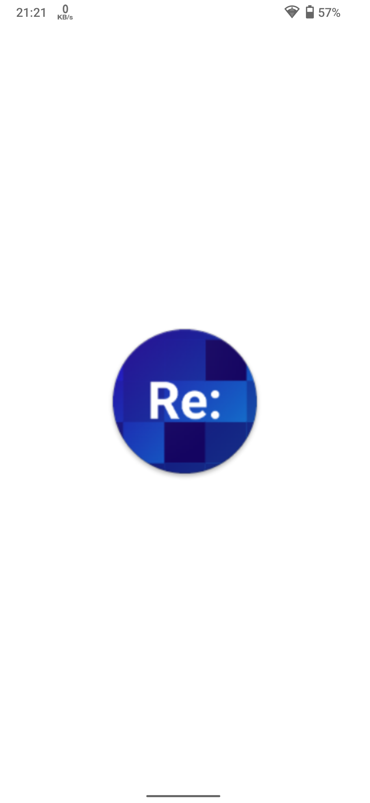
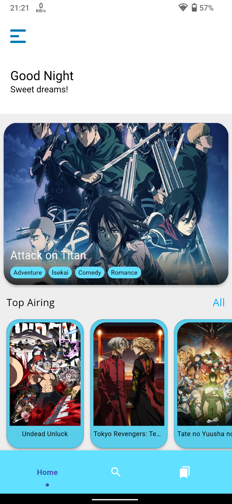
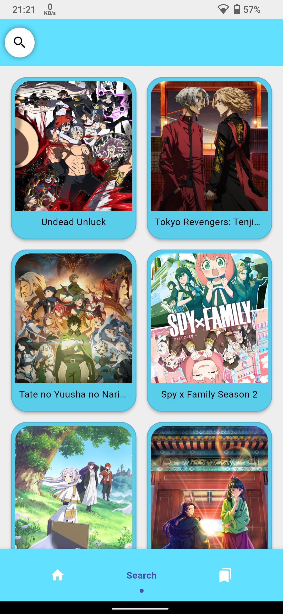
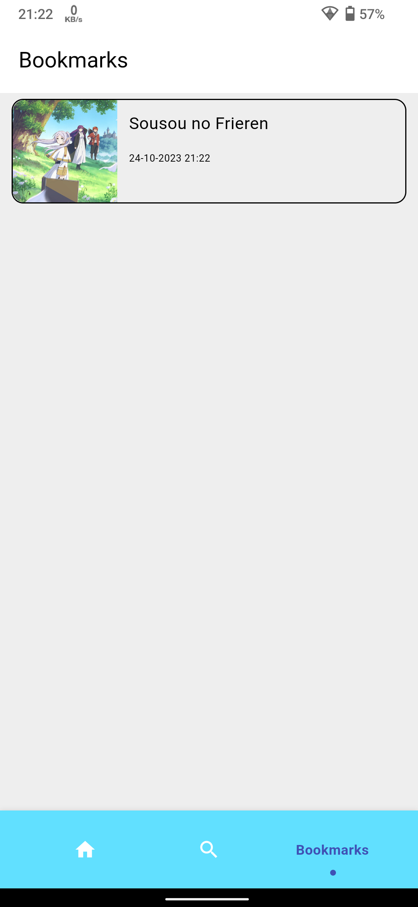
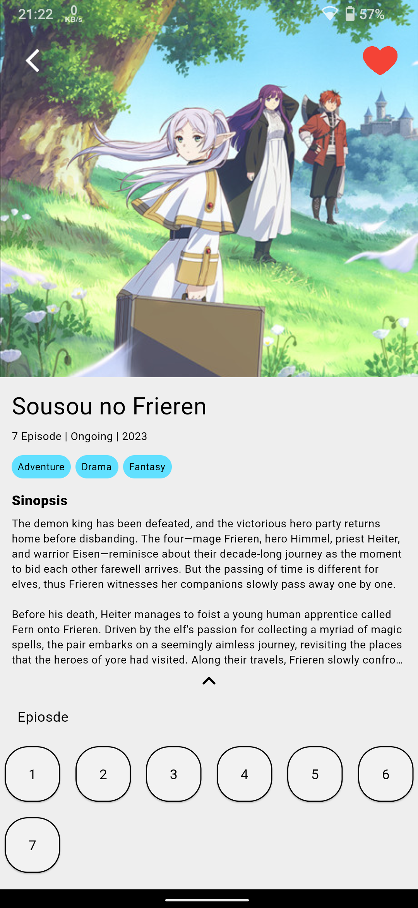

# ReNime

ReNime is a Flutter app for watching anime, built with the Consumet API.

## Introduction

This project marks the beginning of the application's development journey. I am committed to continuous improvement to make this app even better in the future.

## Features

- Watch your favorite anime shows and movies.
- Access a wide range of content via the Consumet API.
- Enjoy a seamless streaming experience on your Flutter app.

## Screenshots

  

    
    
Screenshot 1

  

  
  

    
    
Screenshot 2

  

  
  

    
    
Screenshot 3

  

  

    
    
Screenshot 4

  

  

    
    
Screenshot 5

  

## Get Started

To get started with ReNime, follow these steps:

1. Clone this repository to your local machine.
2. Install Flutter and Dart if you haven't already.
3. Run `flutter pub get` to install dependencies.
4. Connect your device or set up an emulator.
5. Run `flutter run` to launch the app on your device or emulator.

## Contributions

Contributions to ReNime are always welcome. If you'd like to improve the app, fix bugs, or add new features, please feel free to fork the repository and submit a pull request.

## Feedback

If you have any feedback, suggestions, or encounter issues, please open an issue on this repository. Your input is greatly appreciated and helps make ReNime better.
